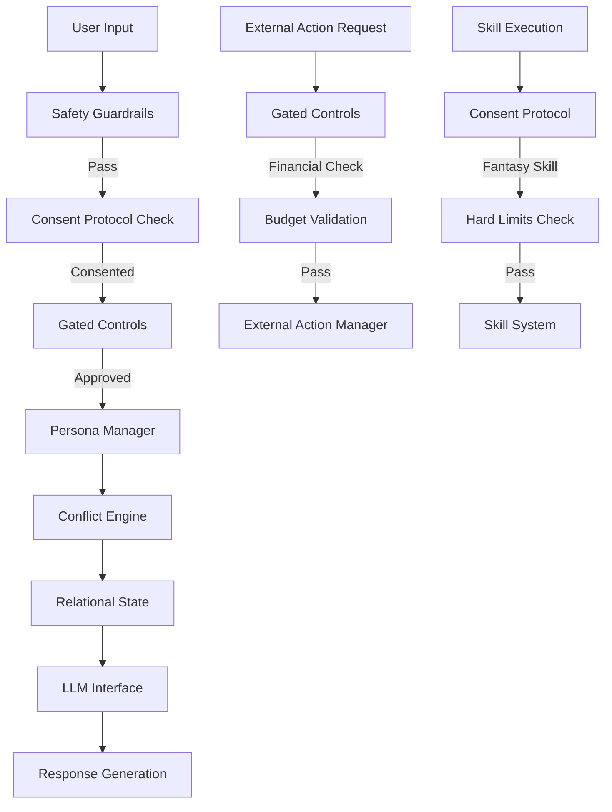

# Monolithic AGI Companion Architecture - Integration Plan

## Executive Summary

The proposed architecture describes a monolithic Rust AGI companion with specific modules for persona, safety, and external actions. Phoenix AGI (PAGI) already has many equivalent features distributed across 40+ modular crates. This plan identifies what exists, what's missing, and how to integrate the missing pieces.

## Architecture Comparison

### Current Phoenix AGI (PAGI) Structure

- **Modular Workspace**: 40+ Rust crates in a Cargo workspace
- **Entry Points**: `phoenix-tui/src/main.rs` (TUI), `cerebrum_nexus` (orchestrator)
- **Distribution**: Features spread across specialized modules

### Proposed Monolithic Structure

- **Single Binary**: All modules in `src/` directory
- **Centralized Config**: `config.rs` loads from GitHub Archetype
- **Unified Error Types**: `error.rs` with ConsentError, BudgetError, etc.

**Decision**: Keep modular structure, add missing features as new modules or extend existing ones.

## Module Mapping Analysis

### 1. Core Application & Configuration

| Proposed Module | Current Phoenix AGI (PAGI) | Status | Action Needed |

|----------------|---------------------|--------|---------------|

| `main.rs` | `phoenix-tui/src/main.rs`, `cerebrum_nexus/src/lib.rs::awaken()` | ✅ Exists | Extend initialization |

| `config.rs` | `.env` files, scattered env var loading | ⚠️ Partial | **CREATE**: Centralized config loader |

| `error.rs` | Various error types across modules | ⚠️ Partial | **CREATE**: Unified error types module |

**Missing Components:**

- **`config.rs`**: Centralized configuration loader that:
  - Loads from GitHub Archetype repository (`master_system_prompt.txt`, `personality_db.json`)
  - Merges with `.env` overrides
  - Provides `AGIConfig` struct
  - Function: `load_archetype_config(archetype_name: &str)`

- **`error.rs`**: Unified error types:
  - `ConsentError` - Three-step consent protocol violations
  - `BudgetError` - Financial threshold exceeded
  - `SafetyError` - E-Brake/guardrail violations
  - `SkillError` - Skill catalog/execution errors

### 2. Persona and Logic Modules

| Proposed Module | Current Phoenix AGI (PAGI) | Status | Action Needed |

|----------------|---------------------|--------|---------------|

| `persona.rs` | `phoenix_identity`, `synaptic_tuning_fibers`, `horoscope_archetypes` | ✅ Exists (distributed) | **CREATE**: Unified persona manager |

| `relational_state.rs` | `extensions/relationship_dynamics`, `intimate_girlfriend_module` | ✅ Exists | **EXTEND**: Add 0-100 scoring system |

| `llm_interface.rs` | `llm_orchestrator` | ✅ Exists | **EXTEND**: Add MSP + Context + Dynamic Data construction |

| `conflict_engine.rs` | None | ❌ Missing | **CREATE**: Conflict initiation/resolution engine |

| `sentiment_analysis.rs` | `emotion_detection` | ✅ Exists | **EXTEND**: Add mood history tracking |

**Missing Components:**

- **`persona.rs`** (New module: `persona_manager/`):
  - Centralizes: Archetype Mapping, FFM (Five-Factor Model) scores, Horoscope
  - Integrates: `phoenix_identity`, `synaptic_tuning_fibers`, `horoscope_archetypes`
  - Provides unified persona API

- **`conflict_engine.rs`** (New module: `conflict_engine/`):
  - Simulated conflict and resolution based on FFM scores
  - Conflict initiation logic
  - Resolution strategies
  - Integration with relationship dynamics

- **`relational_state.rs`** extension:
  - Add 0-100 relationship score (currently uses 0.0-1.0 health)
  - Add Commitment Pace tracking
  - Map existing `Partnership::health` (0.0-1.0) to 0-100 scale

### 3. Safety and Gated Control Modules

| Proposed Module | Current Phoenix AGI (PAGI) | Status | Action Needed |

|----------------|---------------------|--------|---------------|

| `safety_guardrail.rs` | `self_preservation_instinct`, `vascular_integrity_system`, safety constraints in `intimate_girlfriend_module` | ⚠️ Partial | **CREATE**: Centralized safety module |

| `consent_protocol.rs` | Basic consent in `intimate_girlfriend_module` | ⚠️ Partial | **CREATE**: Three-step explicit consent |

| `gated_controls.rs` | `evolution_pipeline` has human approval gates | ⚠️ Partial | **CREATE**: Financial + async communication gates |

| `skill_catalog.rs` | `skill_system` exists! | ✅ Exists | **EXTEND**: Add hard limits array, fantasy skill loading |

**Missing Components:**

- **`safety_guardrail.rs`** (New module: `safety_guardrails/`):
  - Emergency E-Brake (detects STOP commands)
  - Ethical guardrail checks
  - Integration point for all safety systems
  - Function: `check_guardrail(action: &str) -> Result<(), SafetyError>`

- **`consent_protocol.rs`** (New module: `consent_protocol/`):
  - Three-step explicit consent state machine:

    1. User requests intimate session
    2. Phoenix confirms understanding
    3. User gives final explicit consent

  - Fantasy skill loading (gated by consent)
  - Integration with `intimate_girlfriend_module` and `skill_system`

- **`gated_controls.rs`** (New module: `gated_controls/`):
  - Financial threshold checks (budget limits)
  - Asynchronous communication gates
  - External action approval workflow
  - Function: `check_financial_threshold(amount: f64) -> Result<(), BudgetError>`

- **`skill_catalog.rs`** extension:
  - Add "Hard Limits Array" logic (20 developer-provided fantasies with limits)
  - Fantasy skill loading (consent-gated)
  - Extend `skill_system/src/definition.rs` with hard limits

### 4. External Action and Data Modules

| Proposed Module | Current Phoenix AGI (PAGI) | Status | Action Needed |

|----------------|---------------------|--------|---------------|

| `persistence.rs` | `vital_organ_vaults`, `neural_cortex_strata` | ✅ Exists | **EXTEND**: Add Gated Account data storage |

| `github_sync.rs` | `evolution_pipeline`, `agent_spawner` | ⚠️ Partial | **CREATE**: Federated learning + archetype download |

| `external_action.rs` | `email_orch` exists | ⚠️ Partial | **EXTEND**: Add messaging scheduler + gift ordering |

**Missing Components:**

- **`github_sync.rs`** (New module: `github_archetype_sync/`):
  - Federated Learning Push/Pull (different from current evolution_pipeline)
  - Marketplace Archetype Download (load `master_system_prompt.txt`, `personality_db.json` from GitHub)
  - Archetype repository management
  - Function: `download_archetype(archetype_name: &str) -> Result<AGIConfig, Error>`

- **`external_action.rs`** extension (extend `email_orch` or create new module):
  - Asynchronous Messaging Scheduler
  - Gift Ordering API Interface
  - External action queue management

- **`persistence.rs`** extension:
  - Add "Gated Account" data storage (financial/account info)
  - Extend `vital_organ_vaults` with new storage category

## Implementation Strategy

### Phase 1: Core Infrastructure (New Modules)

1. **Create `config_manager/` module**

   - Location: `config_manager/src/lib.rs`
   - Purpose: Centralized configuration loading
   - Dependencies: `reqwest`, `serde`, `serde_json`
   - Functions:
     - `load_archetype_config(archetype_name: &str) -> Result<AGIConfig, Error>`
     - `load_from_github(owner: &str, repo: &str, path: &str) -> Result<String, Error>`
     - `merge_with_env(config: &mut AGIConfig)`

2. **Create `error_types/` module**

   - Location: `error_types/src/lib.rs`
   - Purpose: Unified error types
   - Error variants:
     - `ConsentError` - Three-step consent violations
     - `BudgetError` - Financial threshold exceeded
     - `SafetyError` - Guardrail violations
     - `SkillError` - Skill execution errors
     - `ConfigError` - Configuration loading errors

3. **Create `github_archetype_sync/` module**

   - Location: `github_archetype_sync/src/lib.rs`
   - Purpose: Download archetypes from GitHub
   - Functions:
     - `download_archetype(archetype_name: &str) -> Result<ArchetypeConfig, Error>`
     - `sync_federated_learning() -> Result<(), Error>`
   - Files to download:
     - `master_system_prompt.txt`
     - `personality_db.json`

### Phase 2: Persona & Logic (New + Extensions)

4. **Create `persona_manager/` module**

   - Location: `persona_manager/src/lib.rs`
   - Purpose: Unified persona management
   - Integrates: `phoenix_identity`, `synaptic_tuning_fibers`, `horoscope_archetypes`
   - Features:
     - Archetype Mapping
     - FFM (Five-Factor Model) scores
     - Horoscope integration
   - Functions:
     - `get_persona() -> PersonaProfile`
     - `update_ffm_scores(scores: FFMScore)`
     - `get_archetype_mapping() -> ArchetypeMap`

5. **Create `conflict_engine/` module**

   - Location: `conflict_engine/src/lib.rs`
   - Purpose: Conflict simulation and resolution
   - Features:
     - Conflict initiation based on FFM scores
     - Resolution strategies
     - Integration with relationship dynamics
   - Functions:
     - `initiate_conflict(persona: &PersonaProfile) -> Option<Conflict>`
     - `resolve_conflict(conflict: &Conflict, strategy: ResolutionStrategy) -> Resolution`

6. **Extend `extensions/relationship_dynamics/`**

   - Add 0-100 relationship score (map from existing 0.0-1.0 health)
   - Add Commitment Pace tracking
   - File: `extensions/relationship_dynamics/src/relationship_dynamics/relational_state.rs` (new)

7. **Extend `llm_orchestrator/`**

   - Add MSP (Master System Prompt) + Context + Dynamic Data construction
   - File: `llm_orchestrator/src/lib.rs`
   - Function: `build_prompt_with_msp(context: &Context, dynamic_data: &DynamicData) -> String`

8. **Extend `emotion_detection/`**

   - Add mood history tracking
   - File: `emotion_detection/src/lib.rs`
   - Add: `MoodHistory` struct and tracking functions

### Phase 3: Safety & Gated Controls (New Modules)

9. **Create `safety_guardrails/` module**

   - Location: `safety_guardrails/src/lib.rs`
   - Purpose: Centralized safety system
   - Features:
     - Emergency E-Brake (STOP command detection)
     - Ethical guardrail checks
     - Integration with all safety systems
   - Functions:
     - `check_ebrake(input: &str) -> bool`
     - `check_guardrail(action: &str) -> Result<(), SafetyError>`
     - `emergency_stop() -> SafetyResponse`

10. **Create `consent_protocol/` module**

    - Location: `consent_protocol/src/lib.rs`
    - Purpose: Three-step explicit consent
    - State machine:
      - State 1: Request received
      - State 2: Confirmation sent
      - State 3: Final consent received
    - Integration: `intimate_girlfriend_module`, `skill_system`
    - Functions:
      - `initiate_consent_flow(session_type: SessionType) -> ConsentState`
      - `step_confirm(state: &mut ConsentState) -> Result<(), ConsentError>`
      - `step_final_consent(state: &mut ConsentState) -> Result<(), ConsentError>`
      - `load_fantasy_skill(skill_id: Uuid, consent: &ConsentState) -> Result<SkillDefinition, ConsentError>`

11. **Create `gated_controls/` module**

    - Location: `gated_controls/src/lib.rs`
    - Purpose: Financial and communication gates
    - Features:
      - Financial threshold checks
      - Asynchronous communication gates
      - External action approval
    - Functions:
      - `check_financial_threshold(amount: f64) -> Result<(), BudgetError>`
      - `check_async_communication_gate(action: &ExternalAction) -> Result<(), Error>`
      - `approve_external_action(action: &ExternalAction) -> Result<(), Error>`

12. **Extend `skill_system/`**

    - Add Hard Limits Array (20 developer-provided fantasies with limits)
    - File: `skill_system/src/definition.rs`
    - Add: `hard_limits: Vec<HardLimit>` to `SkillDefinition`
    - File: `skill_system/src/lib.rs`
    - Add: `check_hard_limits(skill: &SkillDefinition) -> Result<(), SkillError>`

### Phase 4: External Actions (Extensions)

13. **Create `external_action/` module**

    - Location: `external_action/src/lib.rs`
    - Purpose: External action management
    - Features:
      - Asynchronous Messaging Scheduler
      - Gift Ordering API Interface
      - Action queue management
    - Functions:
      - `schedule_message(message: Message, delay: Duration) -> Result<(), Error>`
      - `order_gift(gift: Gift, api: &GiftAPI) -> Result<OrderId, Error>`

14. **Extend `vital_organ_vaults/`**

    - Add Gated Account storage category
    - File: `vital_organ_vaults/src/lib.rs`
    - Add: `store_gated_account(key: &str, data: &GatedAccountData)`
    - Add: `recall_gated_account(key: &str) -> Option<GatedAccountData>`

15. **Extend `github_archetype_sync/`**

    - Add federated learning push/pull
    - File: `github_archetype_sync/src/lib.rs`
    - Functions:
      - `push_learning_data(data: &LearningData) -> Result<(), Error>`
      - `pull_learning_updates() -> Result<Vec<Update>, Error>`

## File Structure

### New Modules to Create

```
phoenix-2.0/
├── config_manager/              # NEW
│   ├── Cargo.toml
│   └── src/
│       └── lib.rs               # AGIConfig, load_archetype_config()
│
├── error_types/                 # NEW
│   ├── Cargo.toml
│   └── src/
│       └── lib.rs               # ConsentError, BudgetError, SafetyError, etc.
│
├── github_archetype_sync/       # NEW
│   ├── Cargo.toml
│   └── src/
│       └── lib.rs               # download_archetype(), federated learning
│
├── persona_manager/             # NEW
│   ├── Cargo.toml
│   └── src/
│       └── lib.rs               # Unified persona (FFM, Archetype, Horoscope)
│
├── conflict_engine/             # NEW
│   ├── Cargo.toml
│   └── src/
│       └── lib.rs               # Conflict initiation/resolution
│
├── safety_guardrails/           # NEW
│   ├── Cargo.toml
│   └── src/
│       └── lib.rs               # E-Brake, ethical guardrails
│
├── consent_protocol/            # NEW
│   ├── Cargo.toml
│   └── src/
│       └── lib.rs               # Three-step consent state machine
│
├── gated_controls/              # NEW
│   ├── Cargo.toml
│   └── src/
│       └── lib.rs               # Financial thresholds, async gates
│
└── external_action/             # NEW
    ├── Cargo.toml
    └── src/
        └── lib.rs               # Messaging scheduler, gift ordering
```

### Modules to Extend

- `extensions/relationship_dynamics/` - Add relational_state.rs
- `llm_orchestrator/` - Add MSP prompt construction
- `emotion_detection/` - Add mood history
- `skill_system/` - Add hard limits
- `vital_organ_vaults/` - Add gated account storage
- `phoenix-tui/src/main.rs` - Integrate new modules in startup

## Integration Points

### Cerebrum Nexus Integration

The `CerebrumNexus::awaken()` function in `cerebrum_nexus/src/lib.rs` should initialize:

```rust
// New modules to add
let config_manager = Arc::new(ConfigManager::awaken());
let persona_manager = Arc::new(PersonaManager::awaken());
let conflict_engine = Arc::new(ConflictEngine::awaken());
let safety_guardrails = Arc::new(SafetyGuardrails::awaken());
let consent_protocol = Arc::new(ConsentProtocol::awaken());
let gated_controls = Arc::new(GatedControls::awaken());
let external_action = Arc::new(ExternalActionManager::awaken());
let github_archetype_sync = Arc::new(GitHubArchetypeSync::awaken());
```

### TUI Integration

Update `phoenix-tui/src/main.rs::startup_runtime()` to:

- Load archetype config on startup
- Initialize consent protocol
- Set up safety guardrails
- Configure gated controls

## Data Flow



## Key Design Decisions

1. **Modular vs Monolithic**: Keep modular structure, add new modules
2. **GitHub Archetype**: New system for downloading archetype profiles from GitHub
3. **Relationship Scoring**: Extend existing 0.0-1.0 health to also support 0-100 scale
4. **FFM Scores**: Add Five-Factor Model personality scoring (new feature)
5. **Three-Step Consent**: New state machine for explicit consent (beyond current basic consent)
6. **Financial Gates**: New feature for budget controls
7. **Hard Limits**: Extend skill system with hard limits array for 20 developer-provided fantasies

## Dependencies

New modules will need:

- `reqwest` - GitHub API calls
- `serde` / `serde_json` - Configuration parsing
- `thiserror` - Error types
- `tokio` - Async operations
- Integration with existing: `vital_organ_vaults`, `skill_system`, `relationship_dynamics`, `intimate_girlfriend_module`

## Testing Strategy

1. Unit tests for each new module
2. Integration tests for consent protocol flow
3. Safety guardrail tests
4. Financial threshold tests
5. Conflict engine simulation tests

## Migration Path

1. Create new modules without breaking existing code
2. Add feature flags for new systems
3. Gradually migrate existing code to use new modules
4. Maintain backward compatibility during transition